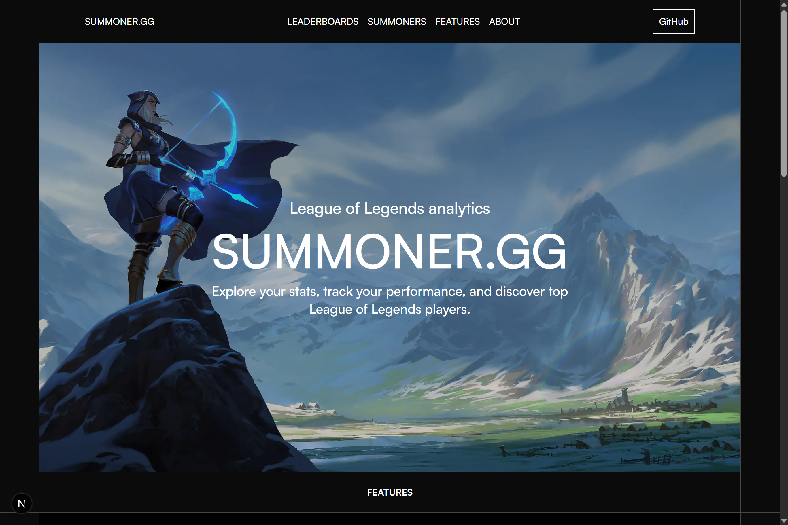
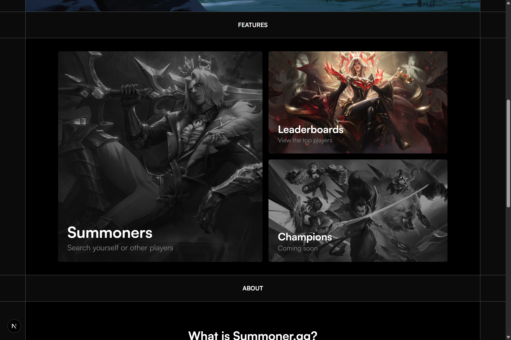
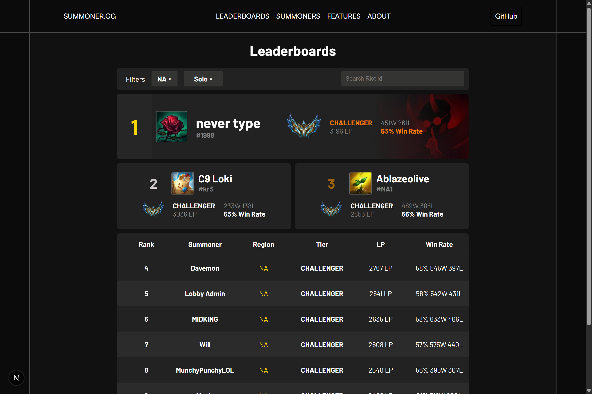
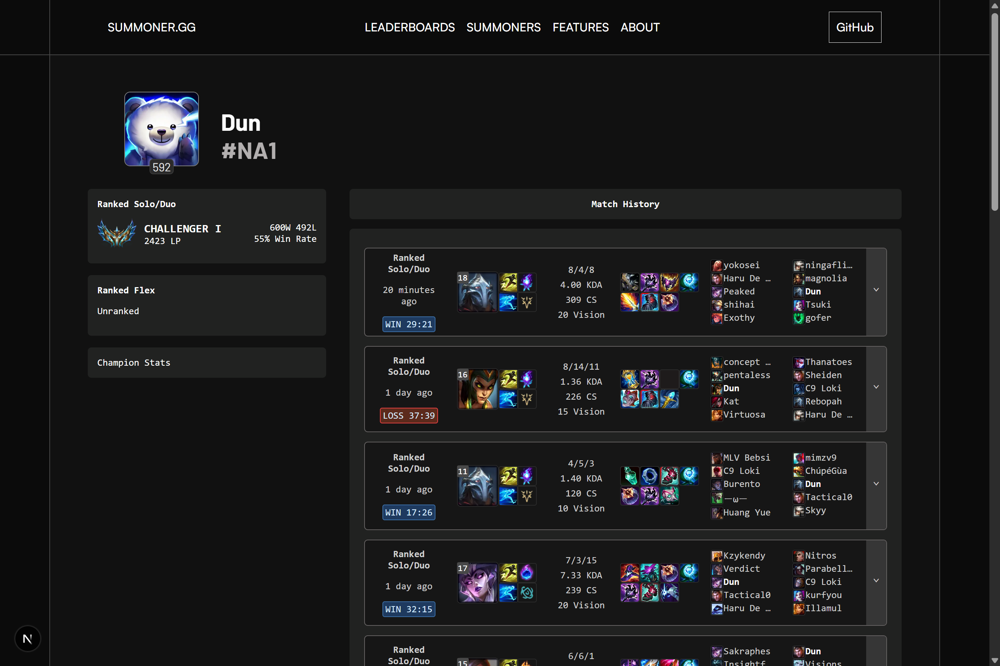
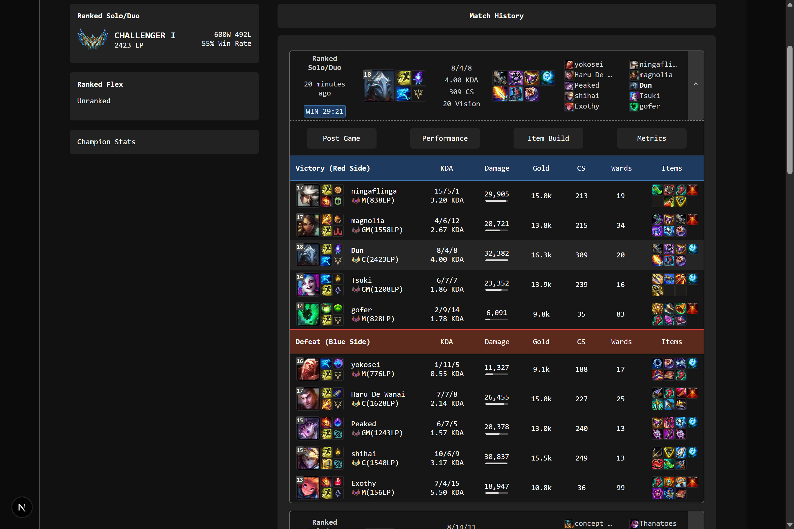

# Summoner.gg

### League of Legends Analytics Platform

🌐 **Live Demo:** https://summoner-gg.vercel.app/

Summoner.gg is a full-stack League of Legends analytics platform that integrates the Riot Games API to provide player profiles, match history, ranked statistics, leaderboards, and detailed match performance data.

The project combines a custom ETL pipeline, database-backed caching, and a relational data model to support efficient data retrieval and future gameplay analytics.

## Screenshots

  
  
  
  
  

## Features

* Player search and detailed summoner profiles.
* Ranked statistics for Solo/Duo and Flex queues.
* Match history with champion, result, KDA, role, and game statistics.
* Detailed match breakdowns, including builds, runes, and summoner spells.
* Leaderboards for supported regions and ranked tiers.
* Persistent match data storage and database-backed caching.
* Responsive user interface for exploring player and match data.

## Tech Stack

**Frontend**

* Next.js
* React
* TypeScript
* CSS Modules
* CSS3

**Backend & Data**

* PostgreSQL
* Neon
* Riot Games API
* Data Dragon

**Infrastructure & Tools**

* Docker
* Vercel
* Git
* GitHub
* pnpm

## Technical Highlights

### ETL Pipeline & Database-Backed Caching

* Engineered an ETL pipeline that extracts match data from multiple Riot Games API endpoints, transforms raw responses into application-specific structures, and loads structured records into PostgreSQL.
* Implemented a database-backed caching strategy that reduced repeat profile load times by **75%**, from 4.0 seconds to 1.0 second, while reducing redundant Riot Games API requests.
* Designed a repository-based persistence layer to separate database operations from application services.
* Established a relational data foundation for future champion, item, rune, and summoner spell analytics.

### Full-Stack Application Architecture

* Built and deployed a full-stack application using Next.js App Router, React, and TypeScript.
* Designed a relational database schema for accounts, matches, participants, champions, items, runes, spells, and ranked snapshots.
* Integrated multiple Riot Games API endpoints to retrieve and process player, ranked, and match data.

### Frontend Development

* Developed reusable React components for player profiles, match history, leaderboards, and detailed match analytics.
* Implemented incremental match history loading using `IntersectionObserver`.
* Built responsive interfaces using custom CSS and CSS Modules.

### Deployment & Development Infrastructure

* Deployed the PostgreSQL database using Neon for persistent data storage.
* Used Docker to support local PostgreSQL development and testing.
* Deployed the web application through Vercel.

## Future Improvements

* Champion win-rate and performance analytics.
* Item, rune, and summoner spell statistics.
* Patch-specific gameplay insights.
* Match timeline visualizations.
* Expanded regional and game-mode support.

## Disclaimer

Summoner.gg is an independent, fan-made project and is not endorsed by Riot Games.

League of Legends and Riot Games are trademarks of Riot Games, Inc.

## License

See the repository for licensing details.
