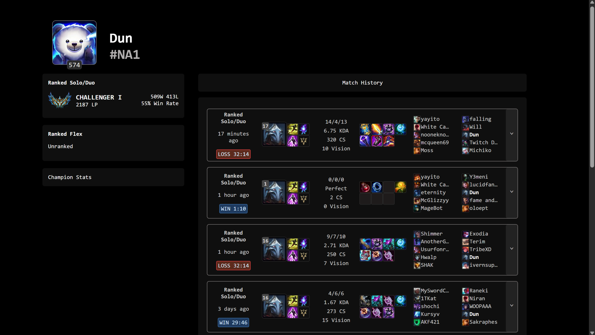
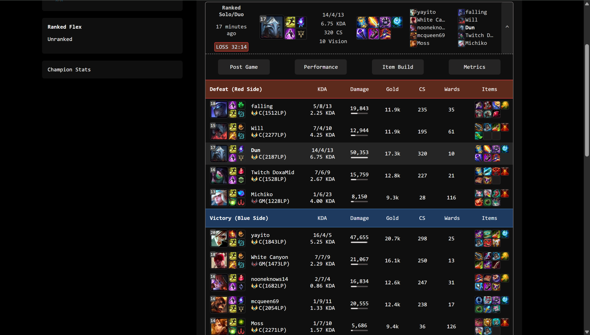

# Summoner.gg

A League of Legends analytics platform inspired by OP.GG and U.GG, built with Next.js, React, and TypeScript.

🌐 **Live Demo:** https://summoner-gg.vercel.app/

  
  

## Overview

Summoner.gg is a web application that allows users to search League of Legends players and explore detailed profiles, ranked information, match history, and individual game statistics.

The application integrates with the Riot Games API to fetch real-time player and match data, while focusing on scalable architecture, efficient data fetching, and clean separation between data processing and UI components.

## How to Use

1. Enter a player's Riot ID in the search bar.

      Use the format: GameName#TagLine

      Example: lorem#vvv

2. Select the player's region.

3. View their profile, ranked information, and recent match history.

> The Riot ID must belong to an existing League of Legends account in the selected region.

## Features

### Player Profiles
- Search players by Riot ID, tag line, and region
- Display summoner icon, level, ranked information, and account details
- Support multiple regions through region mapping

### Match History
- Retrieve and display recent matches using Riot Games API data
- Show detailed match statistics:
  - KDA
  - CS and CS/min
  - Gold earned
  - Vision score
  - Items
  - Runes
  - Summoner spells
  - Champion performance

### Match Details
- Display all 10 participants with:
  - Champion selections
  - Team compositions
  - Individual statistics
  - Item builds

### Data Integration
- Dynamic champion, item, rune, and summoner spell assets using Riot Data Dragon CDN
- Automatic timestamp formatting for match dates

## Architecture

### Data Fetching
- Uses Next.js App Router server components to fetch Riot API data directly without unnecessary client-side requests
- Client components are isolated to interactive UI elements only
- Parallelized API requests with `Promise.all` to reduce match loading time

### Service Layer
- Dedicated service modules handle:
  - Riot API communication
  - Data transformation
  - Data Dragon asset management
- Riot API responses are mapped into internal TypeScript types, preventing API-specific structures from leaking into UI components

### Performance
- Module-level caching for Data Dragon patch information and static game assets
- Reusable typed components for displaying player and match information

## Tech Stack

### Frontend
- Next.js 15 (App Router)
- React
- TypeScript
- CSS Modules

### APIs & Data
- Riot Games API
- Riot Data Dragon CDN

### Deployment
- Vercel

## Future Improvements

### Data Storage
- PostgreSQL database for storing match history and player data
- Reduce repeated Riot API requests by persisting previously retrieved information

### Caching
- Planning to use Redis for frequently requested player profiles and match data

### Analytics
- Champion performance analytics:
  - Win rates
  - KDA trends
  - Item and rune effectiveness
- Ranked progression tracking
- LP history and win/loss streaks

### Additional Features
- Live game tracking
- More detailed player statistics
- Historical performance analysis

